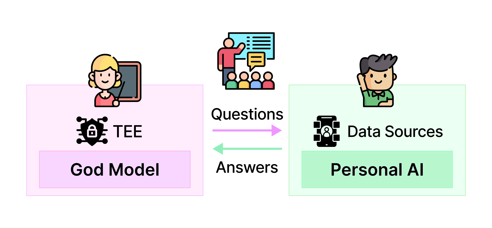

# God Model


*The GOD model, running in a secure TEE, generates realistic user queries. The Personal AI on the user's device processes private data to answer the queries. The GOD model verifies and grades those answers through internal checks or external APIs while ensuring privacy*

## TLDR

This repo introduces methods to generate personalized questions for the God Model v1.

Paper: **GOD model: Privacy Preserved AI School for Personal Assistant** 

<a href='https://arxiv.org/abs/XXXX'></a>

## Abstract

The Guardian of Data (GOD) model is a secure, privacy-preserving framework designed to enhance personal AI assistants by evaluating and refining their recommendations directly on the device. It addresses concerns around data privacy and user trust by operating within a Trusted Execution Environment (TEE) and mitigating the cold start problem through simulated user queries and curriculum-based assessments. By integrating reinforcement and imitation learning along with a token-based incentive system, the GOD model ensures that AI assistants can proactively and responsibly anticipate user needs while maintaining data security and user autonomy.


## God Model Evaluates Personal AI


*The GOD model evaluates the Personal AI by asking personal questions such as height, last email subject, and recent online orders. The Personal AI processes these queries using private, on-device data and responds without exposing raw information.*


## Usage

```bash
python generate_questions.py -o god_model_questions.jsonl -k $OPENAI_API_KEY
```

## Citation

```python
@article{placeholder,
  title={GOD model: Privacy Preserved AI School for Personal Assistant},
  author={PIN AI Team},
  journal={placeholder},
  year={2025}
}
```